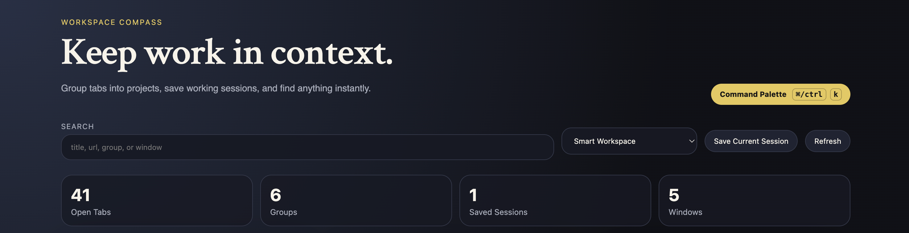

# Workspace Compass

A clean-room browser extension project for smarter tab workspaces. 

 

Most browsers organize information as tabs.

Most knowledge work is organized as projects.

*Workspace Compass* sits between those two ideas.

## Why It Exists

Modern browsers are good at opening tabs and bad at preserving context.

A research project usually involve journal articles, datasets, GitHub repositories, documentation, Overleaf drafts, email threads, and cloud storage.  The browser sees these as unrelated tabs but the user sees them as one project. 

*Workspace Compass* tries to reconstruct that project context using local rules, semantic hints, and workspace-level organization.

## Current Approach

*Workspace Compass* combines three grouping layers.

### 1. Explicit rules

Known websites are classified using user-defined rules.

Examples:

- Research
- Data
- Code
- Writing
- Mail
- Meetings

A JSTOR page can be recognized immediately without any inference.

### 2. Local semantic hints

When a site is unknown, Workspace Compass looks at page title, url, hostname, and scores the tab using local keyword dictionaries.

Examples:

| Signal | Result |
|----------|----------|
| paper.pdf | Research |
| pull request | Code |
| manuscript revision | Writing |
| dataset download | Data |

No external API is required.

No page content is transmitted anywhere.

### 3. Project hints

Some workspaces expose project structure directly.

Examples:

- GitHub repositories
- GitLab repositories
- Overleaf projects
- Notion workspaces

When detected, these become first-class workspace groups.

A repository is often a better grouping unit than a generic "Code" label.

## Current Features

- project-aware grouping
- semantic task grouping
- browser window grouping
- session snapshots
- session restore
- duplicate detection
- command palette (`cmd/ctrl + k`)
- drag-and-drop group ordering
- sync storage support
- pinned tab rules
- favorite groups
- safe DOM rendering
- Firefox, Chrome, and Edge support

## Security

*Workspace Compass* does not use `innerHTML` for tab content rendering.

User-controlled page titles are rendered using explicit DOM nodes and `textContent`.

The extension does not send browsing data to external services.

Semantic grouping is performed locally.

## Project Layout

```text
workspace-compass/
  README.md

  docs/
    DESIGN_NOTES.md

  browser_addon/
    manifest.json
    start.html

    assets/

    styles/
      workbench.css

    scripts/
      00_service_worker.js
      01_browser_gate.js
      02_safe_dom.js
      03_storage_hub.js
      04_tab_reader.js
      05_group_engine.js
      06_session_vault.js
      07_command_center.js
      08_workspace_ui.js
```